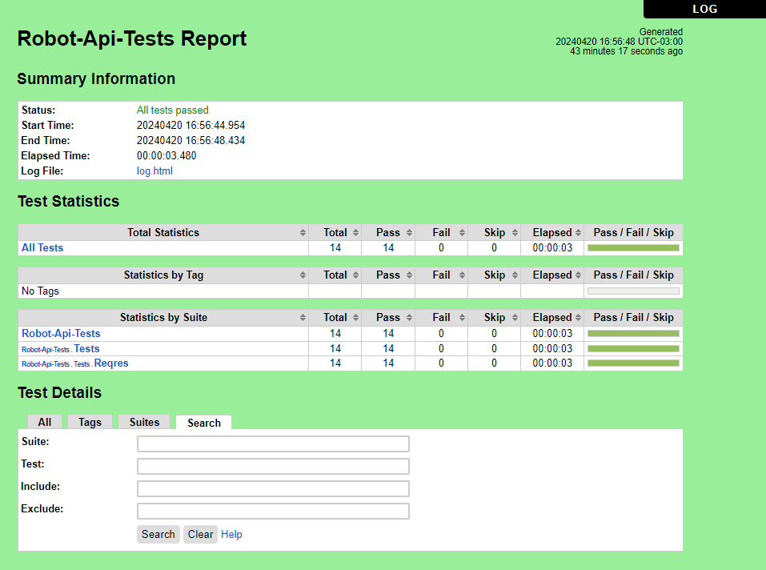
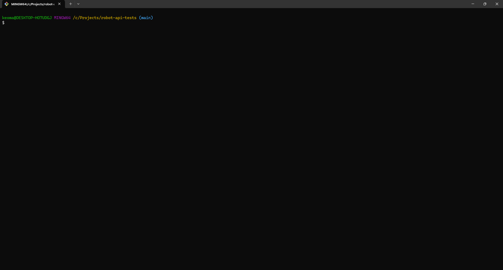

# Robot Framework

A sample API test automation project in [Robot Framework](https://robotframework.org/), using [RequestsLibrary](https://marketsquare.github.io/robotframework-requests/).

## ReqRes

The API chosen for testing was ReqRes. It simulates how a real application behaves, is highly available and accessible from anywhere. For more information, visit their website [here](https://reqres.in/).

## How it works

The project uses Robot Framework as the test framework and RequestsLibrary for HTTP API testing functionality.  
A workflow is set up to install Python, install the required packages, run the tests, and publish the HTML report to GitHub Pages. The report can be viewed [here](https://kafziel4.github.io/robot-api-tests/).

## How to run it

- Install [Python](https://www.python.org/)
- Install the project packages: `pip install -r requirements.txt`
- Run the tests: `robot .`

